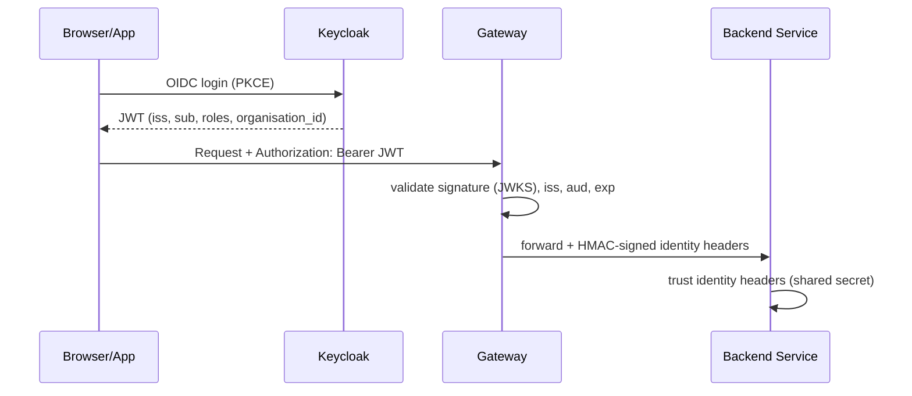

# Authentication Flow

CDPG supports two authentication paths, both terminating at the gateway.

## 1. User authentication (JWT via Keycloak)

Key claims the platform uses:

| Claim | Purpose |
|---|---|
| `sub` | User UUID (used as `owner_id` / `consumer_id`) |
| `roles` | `consumer`, `provider`, `org_admin`, `cos_admin` |
| `organisation_id` | Org-scoped authorization (org_admin checks) |
| `did` | Delegation: delegator's sub when acting on behalf of someone |

## 2. Machine authentication (appID/secret via gRPC)

Apps authenticate with `Authorization: Basic base64(appId:appSecret)`.
The gateway verifies via the controlplane's `VerifyAppId` gRPC (SHA-512 secret
check) and builds the same identity headers as the JWT path.

## Service-to-service gRPC auth

Go services calling the controlplane gRPC (port 9090) use a Keycloak
**client-credentials token** with `scope grpc:controlplane`; the caller's
client ID must be in the controlplane's `grpcAllowedServiceClients` list.

## See also

- [Error Responses](error-responses)
- [JWT Validation guide](../guides/jwt-validation)
