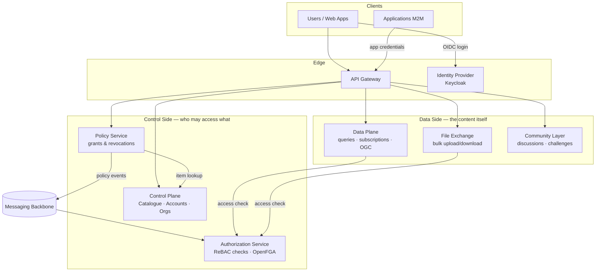

# Architecture Overview

The Data Exchange follows a **control plane / data plane separation**: deciding *who may access what* is handled by the control-side components (catalogue, policy, authorization), while the data-side components (data plane, file exchange) serve the actual content once access is proven.

## System diagram

## Design principles

1. **Single entry point** — every request enters through the API Gateway, which authenticates it once and propagates a signed identity to all internal services. Internal services never re-validate user credentials.

2. **Policy as the source of truth** — access grants live in the Policy Service as explicit, auditable records (who granted what, to whom, until when). The Authorization Service holds a *projection* of those grants optimised for microsecond-level permission checks.

3. **Asynchronous synchronisation** — when a policy is created or revoked, the change is propagated to the Authorization Service through the messaging backbone using a transactional outbox, so the two can never silently diverge: a committed grant is always eventually enforced.

4. **Control/data separation** — components that decide access never sit in the hot path of serving data. The Data Plane asks one fast question ("may this subject do this action on this resource?") and streams the answer-dependent content itself.

5. **Polyglot by design** — components are independently deployable services communicating only through well-defined contracts (REST, gRPC, events), so individual components can be rebuilt or replaced without affecting the rest.

## Component interactions

| From → To | Channel | Purpose |
|---|---|---|
| Gateway → all services | HTTP + signed identity headers | Forward authenticated requests |
| Gateway / services → Control Plane | gRPC | Verify app credentials, resolve delegations, look up catalogue items |
| Policy Service → Control Plane | gRPC | Validate the resource being granted (owner, organisation, allowed access types) |
| Policy Service → Authorization Service | Events (messaging backbone) | Project grants/revocations into the authorization model |
| Data Plane / File Exchange → Authorization Service | HTTP | Real-time permission checks before serving data |
| Services → Control Plane | Events | Outbound email notifications to users |

## Deployment shape

All components run as containers behind the gateway. Shared infrastructure: a relational database (policies, accounts, catalogue metadata), a search engine (catalogue discovery), an object store (file exchange), a cache, and the message broker. Identity is delegated entirely to Keycloak.
