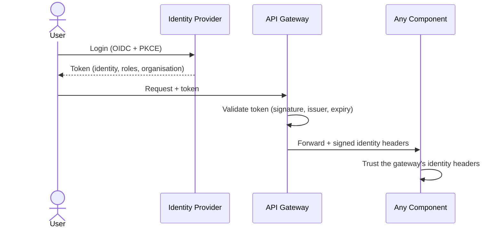

# Flow: Authentication & Identity

How callers prove who they are — once, at the edge.

## Users

## Applications (machine-to-machine)

Applications hold **app credentials** (ID + secret) issued by the Control Plane. The gateway verifies them and produces the same internal identity as the user path — internal components don't know or care which way a caller authenticated.

## Delegation — apps acting for users

An application can be authorised to act **on behalf of a user**:

1. The user records a delegation to the app (scoped: which resources, which actions).
2. The app calls the platform identifying both itself and the user it represents.
3. The gateway verifies the delegation with the Control Plane and forwards the **user's** identity, narrowed to the intersection of the user's rights and the delegation's scope.

The result: an app can never do more than *either* the delegating user *or* the delegation itself allows.

## Why identity is centralised at the gateway

Internal components receive identity as trusted, signed headers and contain **no credential-handling logic at all**. Adding a new authentication method (or rotating keys) touches only the edge.
