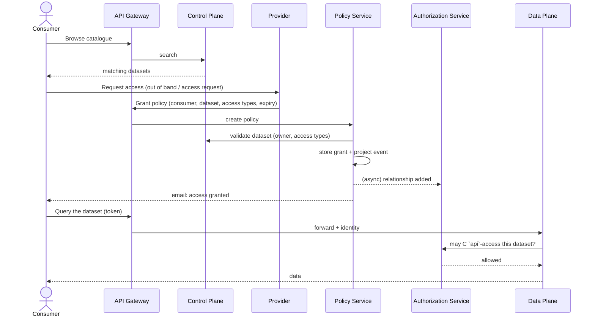

# Flow: Consuming Data

The complete journey from discovering a dataset to receiving its data.

## Stages

1. **Discover** — the consumer searches the catalogue. Metadata is public; the data itself is not.
2. **Request & grant** — the provider (or their org admin) issues a policy naming the consumer, the dataset, the permitted access types, and an expiry.
3. **Propagation** — the grant is automatically projected into the Authorization Service. No manual sync, nothing to deploy.
4. **Consume** — every data request is checked in real time. When the policy expires or is revoked, access stops immediately.
