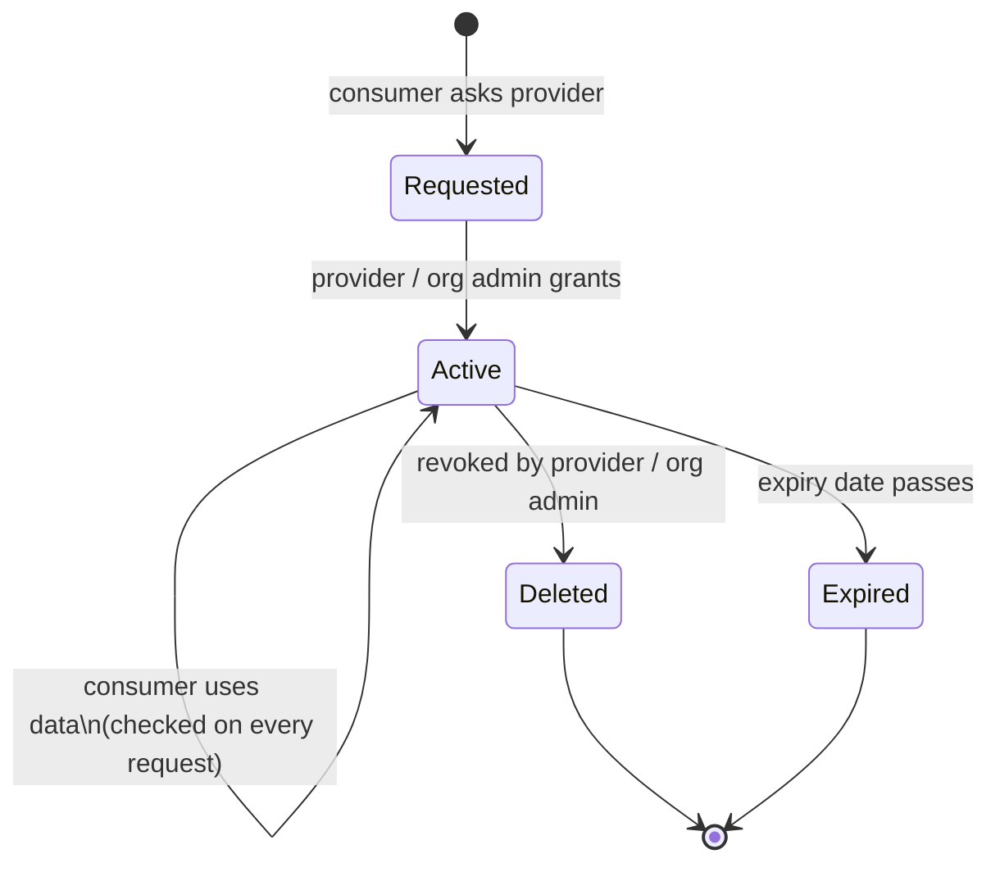

# Flow: Policy Lifecycle

What happens to a grant from creation to revocation.

## Creation

A grant is accepted only if **all** of these hold:

| Check | Enforced against |
|---|---|
| The resource exists | Control Plane catalogue |
| The granter owns it, or is org admin of its organisation | Catalogue ownership + token roles |
| Requested access types are supported by the resource | Catalogue access-type list |
| No overlapping active grant exists | Policy records |
| Expiry is in the future (and bounded) | Policy rules |

## While active

- The grant is enforced on **every** data request via the Authorization Service.
- It appears in the consumer's, provider's, organisation's, and platform's policy listings.
- The consumer was notified by email when it was created.

## Ending

- **Revocation** — the provider or org admin deletes the policy; it is *soft-deleted*, preserving the audit record, and the enforcement relationships are removed within moments.
- **Expiry** — enforcement stops automatically at the expiry timestamp; no action needed.

Either way, the full history of who had access, granted by whom, and when remains queryable.
