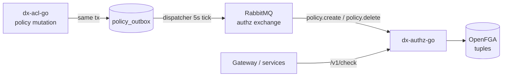

# FGA Authorization

How relationship-based access control (ReBAC) works in CDPG.

## The pipeline

## Tuple mapping

| Policy | FGA tuples written |
|---|---|
| INDIVIDUAL | `user:<consumerId>` → relation per accessType → `<itemtype>:<itemId>` |
| GROUP | one `user:` tuple per `subjects.allowedUserIds`, one `group:` tuple per `subjects.allowedOrgIds` |

Relation = accessType (`api` / `file` / `sub`), or `access` when the policy has
no access list.

## Debugging

- **Tuple missing after policy create** — check the outbox: `SELECT * FROM policy_outbox WHERE sent_at IS NULL;`. If rows pile up, RabbitMQ is down or the dispatcher can't publish; it retries every 5 seconds.
- **Check denied unexpectedly** — query dx-authz-go directly: `POST /v1/check` with subject/relation/object, then inspect the OpenFGA store.
- **Duplicate delivery** — safe: the consumer dedupes by per-tuple request ID.
